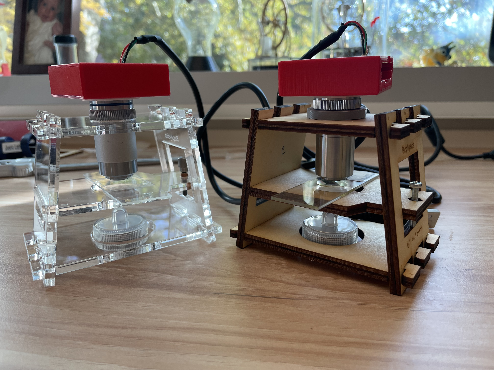
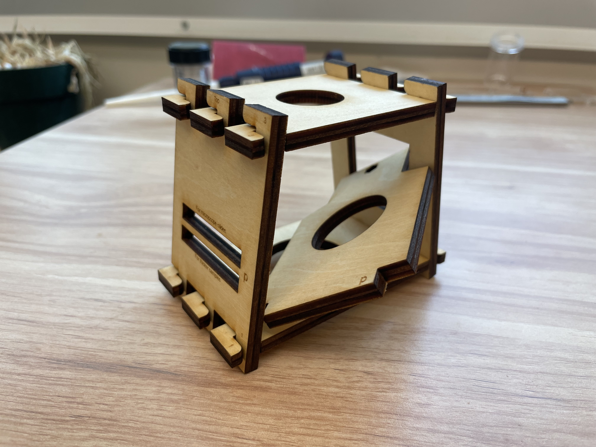

# Name: simple_microscope
This microscope grew out of a need created by the pandemic, during Spring 2020. To implement a brownian motion lab for the biophysics lab course, I built microscopes similar to this, and the students carried out the experiment at their homes.

  

The microscope on the left uses acrylic and a fine adjuster. The microscope on the right uses plywood, a coarse adjuster, and the objective spacer (required for the second Amscope objective - see below)  

Microscope with image of 1 micron polystyrene beads imaged with the microscope:  

## Description & Parts
The microscope includes the following parts:

### Objective lens
The microscope is designed for an objective with RMS threading and a parfocal length of about 45 mm. We use these ~$25 objectives from Amscope:  
- https://amscope.com/products/a40x-v300?variant=40347660681391 
or:
- https://amscope.com/products/a40x-yx-v460 (This objective requires the use of a spacer; see below.)

### Camera

Arducam camera chip: (here ~$30)
https://www.amazon.com/dp/B07YHK63DS?ref=ppx_yo2ov_dt_b_fed_asin_title&th=1

### Light source

A small tea light works:
https://www.amazon.com/dp/B07654MKZH?ref=ppx_yo2ov_dt_b_fed_asin_title&th=1

### Camera housing

3D printed with an FDM printer. Also requires a 3D printed adapter for attaching the objective. 

### Framework

Laser cut from nominal 3/16" thick acrylic or plywood. 

### Vertical translation 

There are two options:
- Coarse:  Using a 20 mm M3x0.5 bolt with M3x0.5 mm nut
- Fine: Using a 25 mm M3x0.20 adjuster from Thorlabs
    - F3ES25
    - F3ESK1
    - F3ESN1P
    
### Misc parts (both 3D printed)

- Spacer ring if the second Amscope objective above is used
- Tool to help remove lens

## Creating the necessary parts. All parts were designed in OpenSCAD (see objects folder).
### 3D Printed parts
We print these with an FDM printer (Raise3D Pro 3 with hyperspeed option), using standard parameters. They are designed to be printed without supports, with the z-axis in OpenSCAD pointing up on the printer (this is the default orientation when the stl files are imported into IdeaMaker for the Raise3D printer.)
1. Camera housing
    - v3 is for the current model of the camera (11/24)
    - v1.1 is for an older model of the camera
2. Objective-camera housing adapter
3. Objective spacer (if using the second Amscope objective)
4. Camera lens remover (tool to help remove the lens from the camera)

### Laser cut parts - microscope framework
We cut these using an Epilog Zing laser cutter/engraver, using nominal 3/16" thick acrylic or plywood.The actual thickness of products we have used seems to vary enough that one needs to measure the thickness of each piece before cutting.  
1. Measure thickness of stock using caliper, in mm. 
2. Adjust parameters in OpenSCAD code.
3. Export to DXF
4. Import DXF file into CorelDraw or Inkscape. If using labels, there is a default coreldraw file called simple_microscope_labels_only.cdr which can be used as a template. The dxf file can be imported on top of the labels, and its position adjusted.
5. Cut/engrave.  For our 60W Epilog Zing, the following Speed/Power values were used for nominal 3/16" thick material:

Table to get main OpenSCAD parameters.

| Material | Design         | Main Slot Height | Sample Platform Slot Height |
|----------|----------------|------------------|-----------------------------|
| Acrylic  | Slot           | d + 0.36 mm      | d + 0.37 mm  (?)            |
| Acrylic  | Interlocking   | d + 0.42 mm      | d + 0.37 mm                 |
| Plywood  | Slot           | d + 0.27 mm      | d + 0.42 mm                 |
| Plywood  | Interlocking   | d + 0.47 mm      | d + 0.42 mm                 |

Other parameters that may need adjusting include hex_nut_radius and fine_thread_cylinder_radius, depending on hex nut size and laser kerf
 
Table to get laser power (for Epilog Zing, 60 W)
| Material (3/16) | Raster  |  Vector  |
|-----------------|---------|----------|
| Acrylic         | S90/P25 | S35/P100 |
| Plywood         | S90/P30 | S70/P65  |

## Assembly

Two views of the microscope:  

  

### Step-by-step 
The parts of the microscope.  

  

1. The pieces interlock. Numbers indicate which pieces should be together. Attach the first side to the bottom and lock so that the 1s line up.   

  

2. Attach the other side.  
 
  

3. Place the top onto both sides without locking.

  

4. Once the top is on both sides, then lock both sides simultaneously.

 
   
5. The nut presses into a matching hold on the sample platform piece.

  

6. After pressing the nut in. If you use the fine adjustement, instead of a nut, you'll use a cylindrical sleeve.

  

7. Next slide the platform in so the tab with the nut enters the square hole on the side.

  

8. Then place the other tab in the slot on the other side of the framework.

  

9. Thread the bolt in the nut, and screw it in until the platform is level. The framework is finished. 

  

10. The objective and objective_camera-housing adapter.

  

11. Screw the adaptor onto the objective. Some fiddling may be required to get the threads correct. 
 
  

12. Objective & adaptor with camera housing. Screw the adaptor into the camera housing.

  

13. Complete, waiting for the camera board.

  

14. Slot the camera board in. Be sure to remove the lens from the camera first. 

  

15.With this objective, the objective spacer (grey) is needed. 
 
  

16. Spacer inserted.

  

17. Next insert the objective into the spacer (or hole in the top).

  

Complete. 

  

With light source turned on.

  

## Authors and acknowledgment

## License
